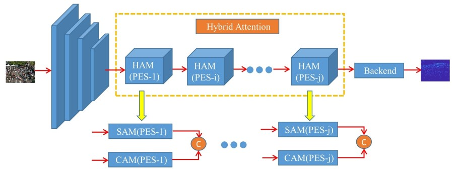

# Hybrid attention network based on progressive embedding scale-context for
crowd counting
* The paper is under review.

* Paper [Link]()

## Overview

# Data processing
* Shanghai Tech A  randomly crop 4 patch of 128x128 from each image.
* Shanghai Tech B  randomly crop 4 patch of 256x256 from each image.
* UCF-CC-50  randomly crop 8 patch of 128x128 from each image.
* QNRF  randomly crop 8 patch of 128x128 from each image.
* NWPU-Crowd  randomly crop 1 patch of 576x768 from each image.

# Training
* update root "HOME and DATASET" in ./config.py.
* python train.py

# Testing
* python eval.py

# Evaluation metrics
* MSE and MSE 

# Visualization
* python vis.py

# Environment
	python >=3.6 
	pytorch >=1.5
	opencv-python >=4.0
	scipy >=1.4.0
	h5py >=2.10
	pillow >=7.0.0
	imageio >=1.18

